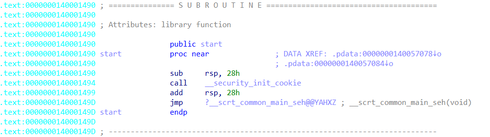

# #1

### File

- [sample01.exe](./files/sample01.exe)


<br>


### Analysis



- 
    Exports → start


<br>


### Code

```
#include <windows.h>
#include <winuser.h>

typedef unsigned __int64 QWORD;

LRESULT CALLBACK WndProc(HWND hWnd, UINT uMsg, WPARAM wParam, LPARAM lParam)
{
	if (uMsg != WM_CREATE) {
		if (uMsg != WM_DESTROY) {
			return DefWindowProcA(hWnd, uMsg, wParam, lParam);
		}
		PostQuitMessage(0);
	}

	return 0;
}

int __stdcall WinMain(HINSTANCE hInstance, HINSTANCE hPrevInstance, LPSTR lpCmdLine, int nShowCmd)
{
	struct tagMSG Msg;
	WNDCLASSA WndClass;

	if (FindWindowA(NULL, "sample01")) {
		return 0;
	}

	WndClass.hbrBackground = COLOR_3DSHADOW;
	*(QWORD *)&WndClass.cbClsExtra = 0;
	WndClass.hCursor = LoadCursorA(NULL, IDC_ARROW);
	WndClass.hInstance = hInstance;
	WndClass.hIcon = LoadIconA(NULL, IDI_APPLICATION);
	WndClass.lpfnWndProc = (WNDPROC)WndProc;
	WndClass.lpszClassName = "sample01";
	WndClass.lpszMenuName = NULL;
	WndClass.style = CS_VREDRAW | CS_HREDRAW;

	RegisterClassA(&WndClass);

	HWND newWindow = (__int64)CreateWindowExA(
		0,
		"sample01",
		"sample01",
		WS_CLIPCHILDREN | WS_CAPTION | WS_MINIMIZEBOX | WS_SYSMENU, 
		100,
		100,
		100,
		10,
		NULL,
		NULL,
		hInstance,
		NULL);

	while (GetMessageA(&Msg, NULL, 0, 0))
	{
		TranslateMessage(&Msg);
		DispatchMessageA(&Msg);
	}

	return Msg.wParam;
}

```


<br>


### Reference

- [https://velog.io/@j4hmilli/securityinitcookie와-scrtcommonmainseh-이해하기](https://velog.io/@j4hmilli/securityinitcookie%EC%99%80-scrtcommonmainseh-%EC%9D%B4%ED%95%B4%ED%95%98%EA%B8%B0)
- [https://tribal1012.tistory.com/187](https://tribal1012.tistory.com/187)
- [https://learn.microsoft.com/ko-kr/windows/win32/winmsg/using-messages-and-message-queues](https://learn.microsoft.com/ko-kr/windows/win32/winmsg/using-messages-and-message-queues)
- [https://learn.microsoft.com/ko-kr/windows/win32/api/winuser/nf-winuser-defwindowproca](https://learn.microsoft.com/ko-kr/windows/win32/api/winuser/nf-winuser-defwindowproca)
- [http://www.soen.kr/lecture/win32api/reference/Function/DefWindowProc.htm](http://www.soen.kr/lecture/win32api/reference/Function/DefWindowProc.htm)
